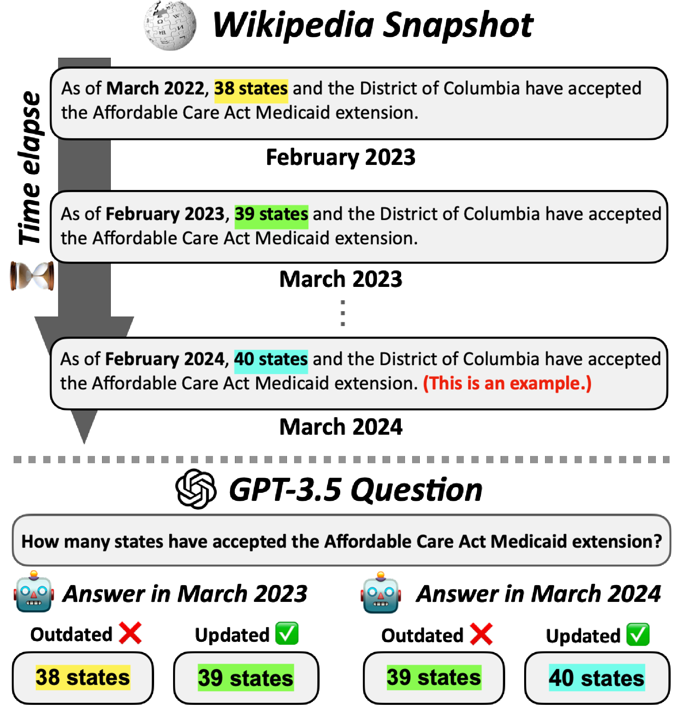

# EvolvingQA_benchmark
🎉 Accepted to NAACL 2024 (main)  
🎉 Accepted to NeurIPS 2023 Workshop on SyntehticData4ML (Oral)  

> We introduce **EvolvingQA**, a temporally evolving question-answering benchmark designed for training and evaluating LMs on an evolving Wikipedia database. EvolvingQA uncovers that existing continual learning baselines suffer from updating and removing outdated knowledge.

</img>

The EvolvingQ dataset and codes are released. 
Note that the released version of EvolvingQA is constructed with additional filtering processes (e.g., changing order of options in multiple-choice prompts), based on the feedback from reviewers.  
The dataset is released in [EvolvingQA benchmark](https://www.dropbox.com/scl/fo/40omxt6ooi4k02sg9acrp/h?rlkey=8b9y0kq33tl0p3qou24l1yx2q&dl=0).

